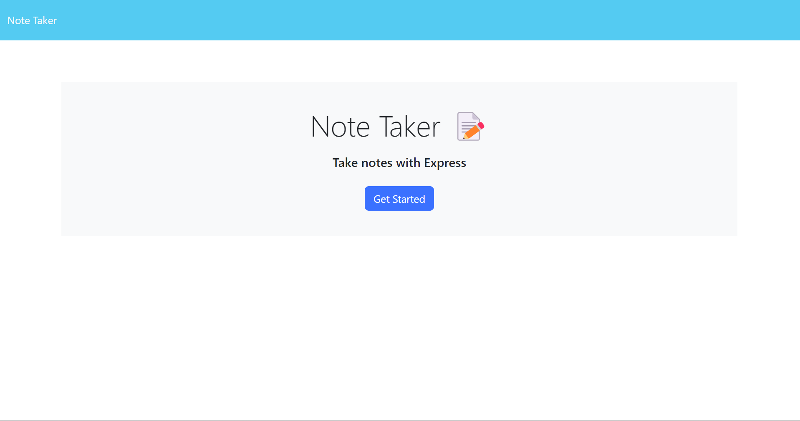

# Note-Taker-Project


## Description

This note-taking app allows small business owners to write and save notes. The landing page provides a link to the notes page where existing notes are displayed in the left-hand column. Users can add new notes by entering the note title and text in the empty fields on the right-hand column. After entering the new note, a Save icon appears on the top navigation bar. Clicking on the Save icon saves the note, and it appears in the left-hand column with the other existing notes.

[Link to Deployed Webpage]()




## User Story

AS A small business owner
I WANT to be able to write and save notes
SO THAT I can organize my thoughts and keep track of tasks I need to complete


## Acceptance Criteria

GIVEN a note-taking application
WHEN I open the Note Taker
THEN I am presented with a landing page with a link to a notes page
WHEN I click on the link to the notes page
THEN I am presented with a page with existing notes listed in the left-hand column, plus empty fields to enter a new note title and the note’s text in the right-hand column
WHEN I enter a new note title and the note’s text
THEN a Save icon appears in the navigation at the top of the page
WHEN I click on the Save icon
THEN the new note I have entered is saved and appears in the left-hand column with the other existing notes
WHEN I click on an existing note in the list in the left-hand column
THEN that note appears in the right-hand column
WHEN I click on the Write icon in the navigation at the top of the page
THEN I am presented with empty fields to enter a new note title and the note’s text in the right-hand column


## Table Of Contents

* [Installation](#installation)
* [Usage](#usage)
* [License](#license)
* [Contributing](#contributing)
* [Test](#test)
* [Questions](#questions)

## Installation

To install dependencies, run the following command: 

```
npm install
```

## Usage


## Contributing


## Test


## Technologies Used

- Node
- ExpressJS
- JAVASCRIPT

## Credits

Devarsh Patel

## License

MIT License

## Questions

To ask questions about the project, contact me directly at devarsh2395@gmail.com. You can find more of my work at [devarsh2395](https://github.com/devarsh2395/).

